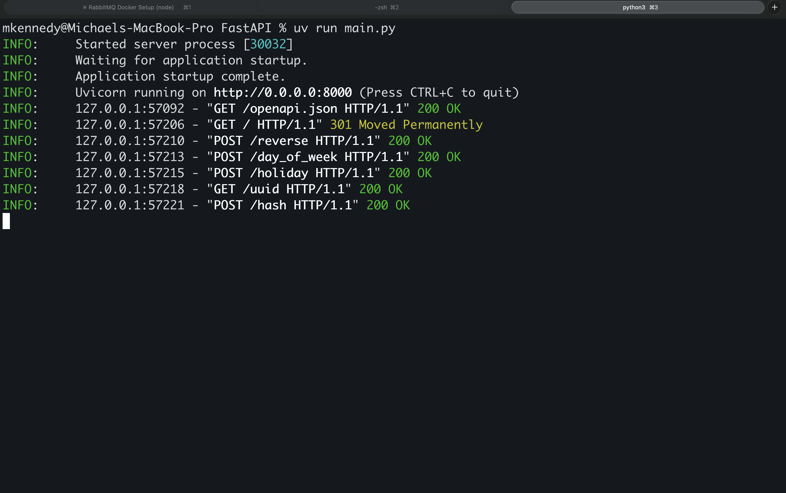
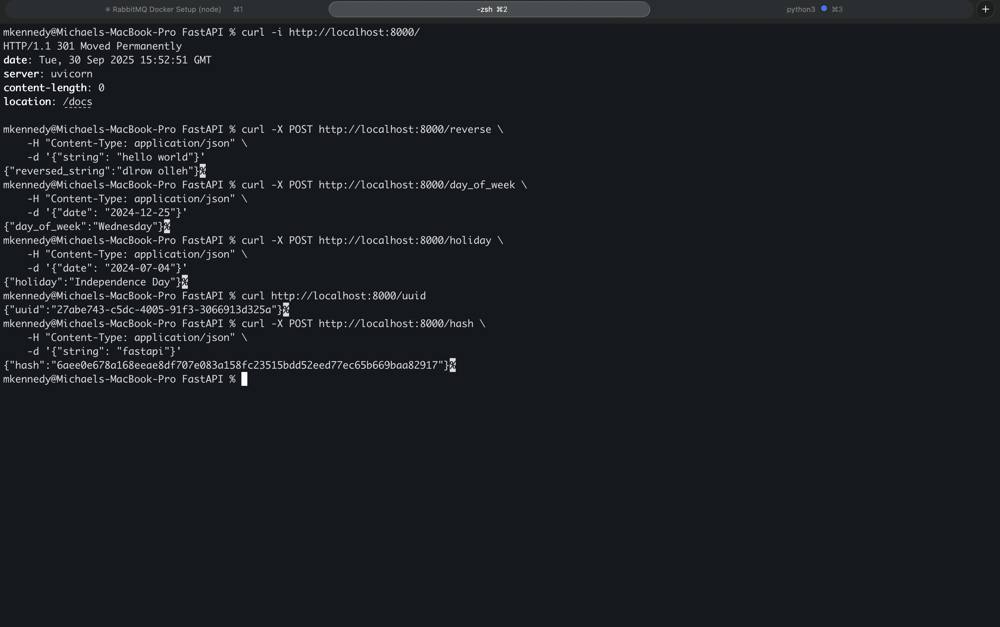

# FastAPI Starter

A simple FastAPI application with automatic Swagger documentation providing various utility endpoints.

## Getting Started

1. Install dependencies:
```bash
uv sync
```

2. Run the server:
```bash
python main.py
```

The server will start at `http://localhost:8000`

## API Documentation

Interactive API documentation is automatically generated and available at:
- **Swagger UI**: `http://localhost:8000/docs` (when running locally)
- **ReDoc**: `http://localhost:8000/redoc` (when running locally)
- **OpenAPI JSON**: `http://localhost:8000/openapi.json` (when running locally)

The root endpoint (`/`) redirects to the Swagger documentation for easy access.

### Static Documentation

For assignment submission and offline viewing, static API documentation is also available:
- **GitHub Pages**: [View API Documentation](https://mkennedy85.github.io/FastAPI/api-docs) (hosted via GitHub Pages)
- **Local HTML**: Open `docs/api-docs.html` in your browser after generating static docs

## Endpoints

### GET `/`
Redirects to the Swagger documentation (`/docs`).

### POST `/reverse`
Reverses a given string.

**Request Body:**
```json
{
  "string": "hello"
}
```

**Response:**
```json
{
  "reversed_string": "olleh"
}
```

**Example:**
```bash
curl -X POST http://localhost:8000/reverse \
  -H "Content-Type: application/json" \
  -d '{"string": "hello"}'
```

### POST `/day_of_week`
Returns the day of the week for a given date.

**Request Body:**
```json
{
  "date": "2024-12-25"
}
```

**Response:**
```json
{
  "day_of_week": "Wednesday"
}
```

**Example:**
```bash
curl -X POST http://localhost:8000/day_of_week \
  -H "Content-Type: application/json" \
  -d '{"date": "2024-12-25"}'
```

### POST `/holiday`
Checks if a given date is a US holiday.

**Request Body:**
```json
{
  "date": "2024-12-25"
}
```

**Response:**
```json
{
  "holiday": "Christmas Day"
}
```

**Example:**
```bash
curl -X POST http://localhost:8000/holiday \
  -H "Content-Type: application/json" \
  -d '{"date": "2024-12-25"}'
```

### GET `/uuid`
Generates a universally unique identifier (UUID4).

**Response:**
```json
{
  "uuid": "123e4567-e89b-12d3-a456-426614174000"
}
```

**Example:**
```bash
curl http://localhost:8000/uuid
```

### POST `/hash`
Generates a SHA256 hash of a given string.

**Request Body:**
```json
{
  "string": "hello"
}
```

**Response:**
```json
{
  "hash": "2cf24dba4f21d4288094e9b8a1e8f8c4a3d5f7b4b1e3c6a8b9c0d1e2f3a4b5c6"
}
```

**Example:**
```bash
curl -X POST http://localhost:8000/hash \
  -H "Content-Type: application/json" \
  -d '{"string": "hello"}'
```

## Screenshots

### Server Running


### API Requests and Responses


## Dependencies

- FastAPI - Web framework
- Pydantic - Data validation
- holidays - US holiday data
- uvicorn - ASGI server

## Date Format

All date inputs should be in `YYYY-MM-DD` format (ISO 8601).